# Projet DATA_MANIPULATION :Analyse des données et statistique inférentielle

## Installation

1. **Créer un environnement virtuel :**

    ```
    python -m venv venv
    ```

2. **Activer l'environnement virtuel :**

    
    ```
    .\venv\Scripts\activate
    ```

3. **Installer les dépendances :**

    ```bash
    pip install -r requirements.txt
    ```

4. **Appliquer les migrations de la base de données :**

    ```bash
    python manage.py migrate
    ```

## Réalisation

### Tableau de bord

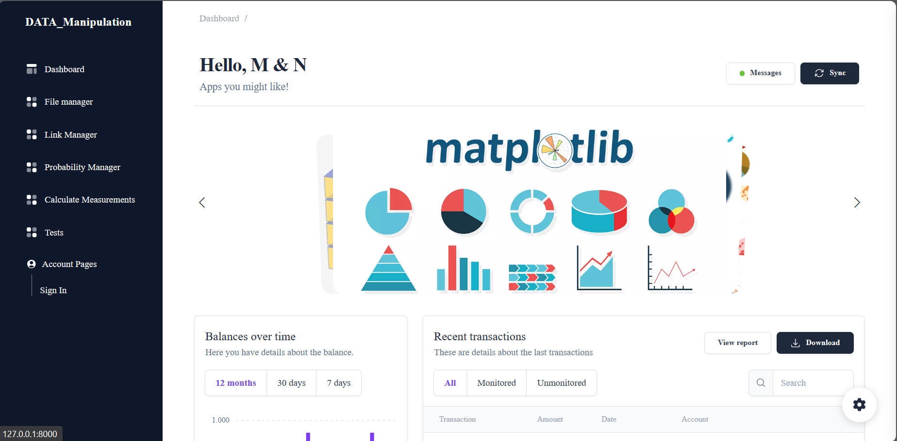

### Gestionnaire de fichiers

Le gestionnaire de fichiers permet de manipuler les données du projet de la manière suivante :
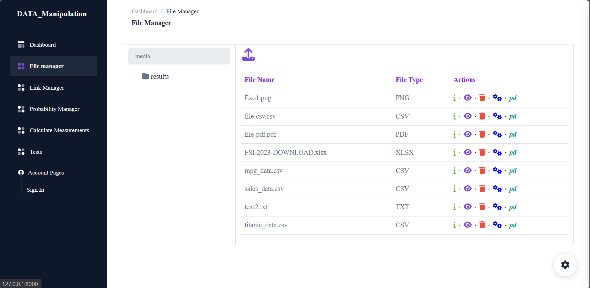

- **Visualisation des données :**
 Visualiser les données à l'aide plotly.
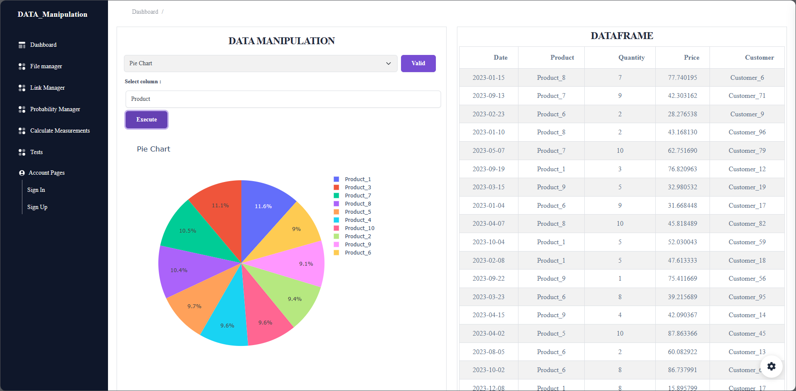
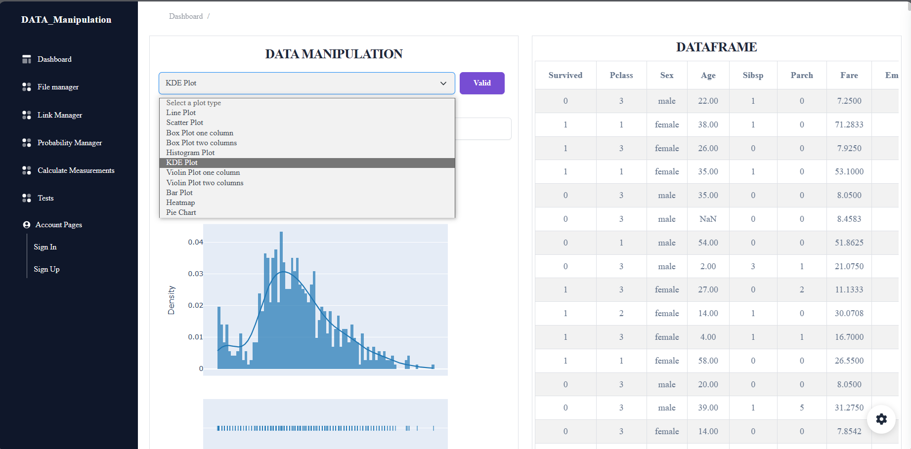


- **Parcourir les données :** 
Explorer les données en fonction des lignes ou colonnes spécifiées.

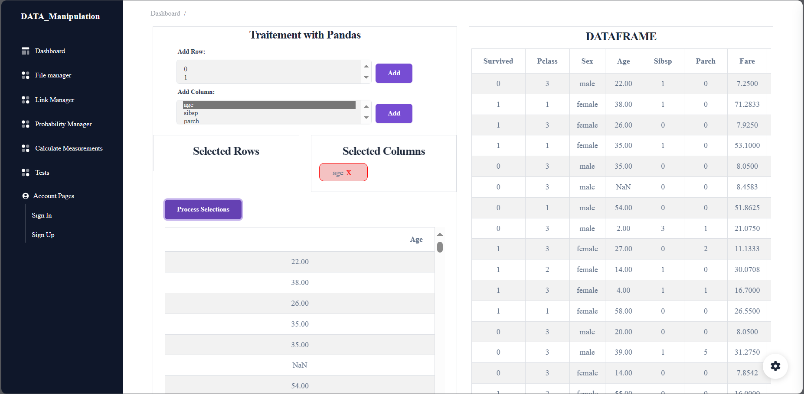
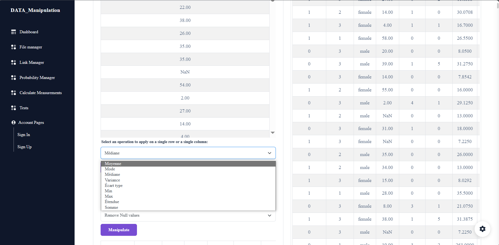
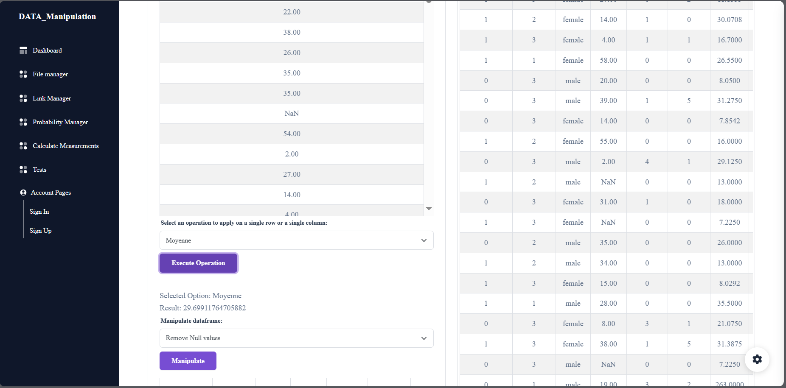
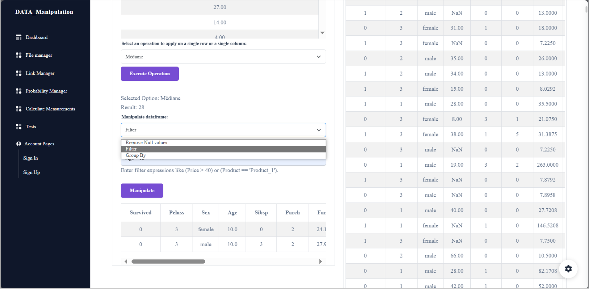

- **Visualiser le fichier :**
 Afficher le contenu des fichiers.
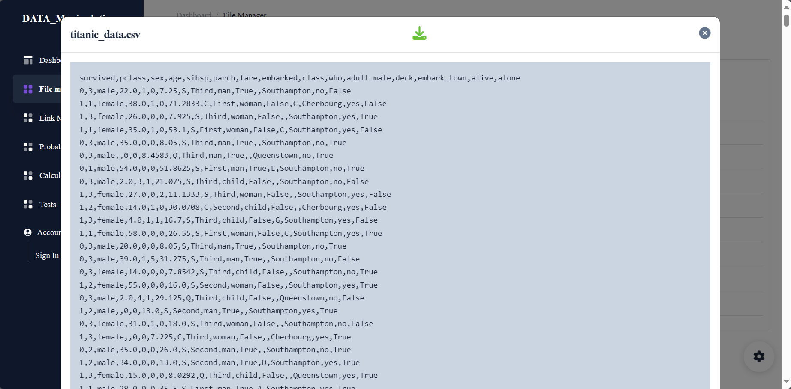

### Gestionnaire de liens

Le gestionnaire de liens facilite la gestion des liens dans le projet. Ensuite, toutes les opérations nécessaires sont effectuées sur le DataFrame.
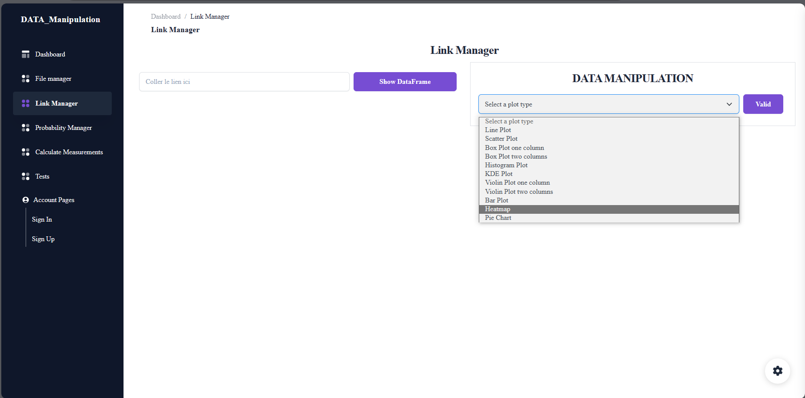

### Gestionnaire de probabilités
Le gestionnaire de probabilités permet d'analyser les lois de probabilité en fonction des données saisies.
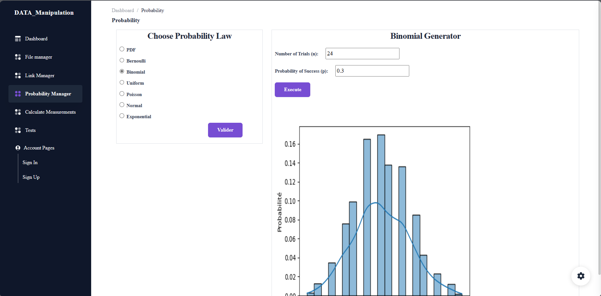

### Calcul des mesures
Le calcul des mesures permet d'effectuer des calculs de mesures statistiques sur les données du projet.
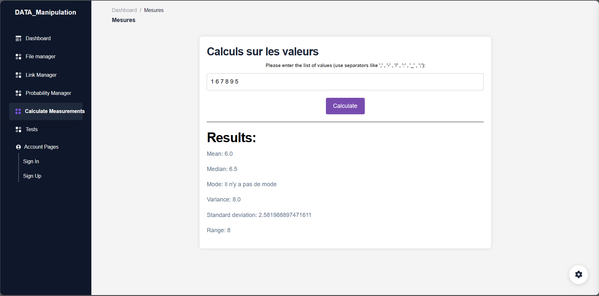
### Les tests
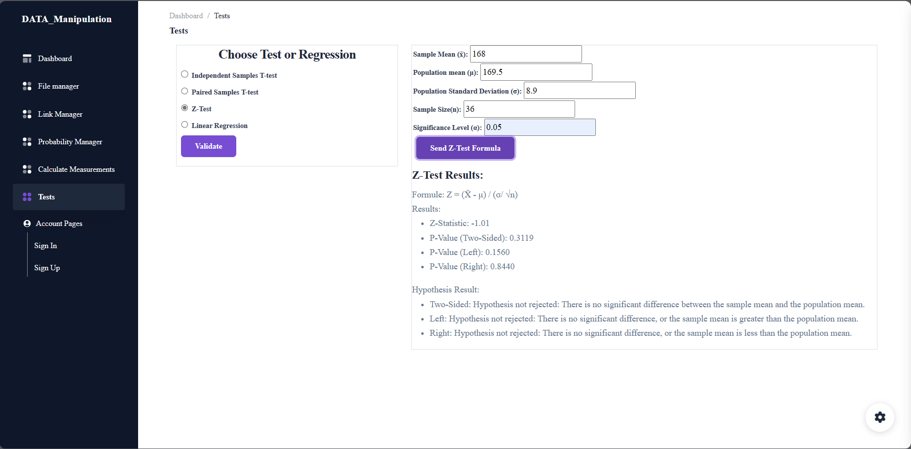


